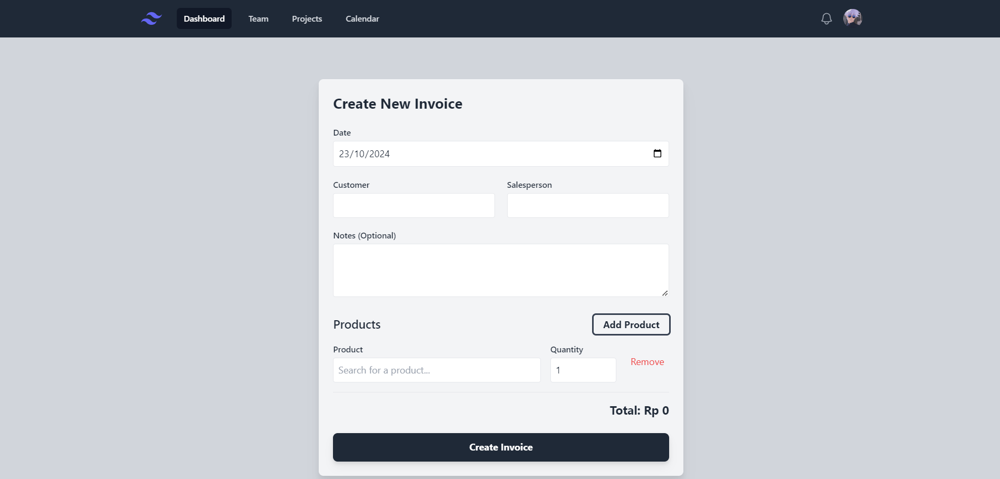
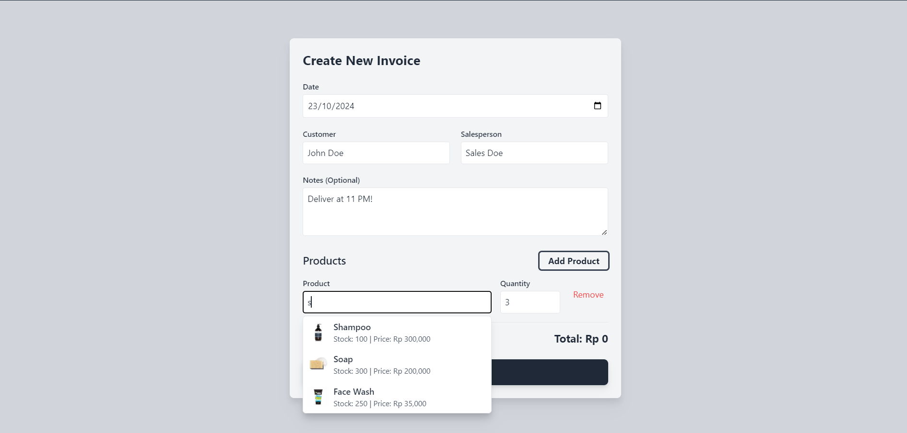
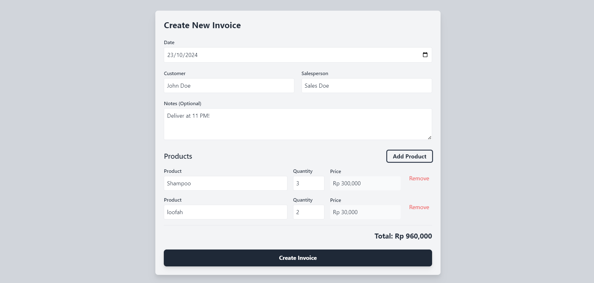
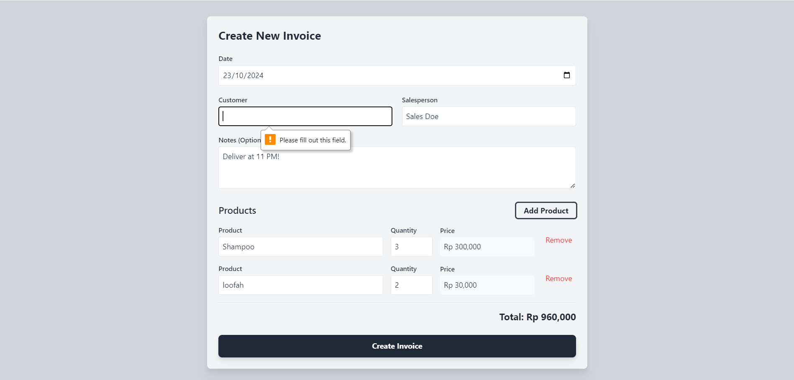
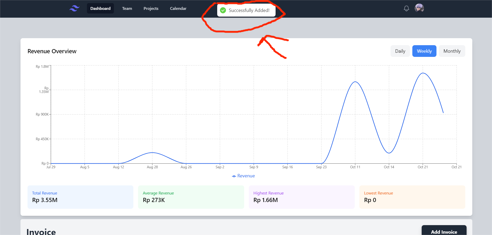
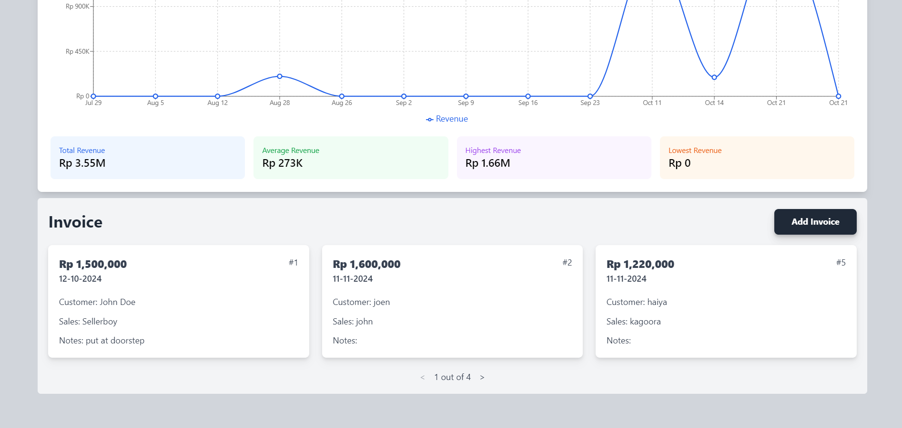
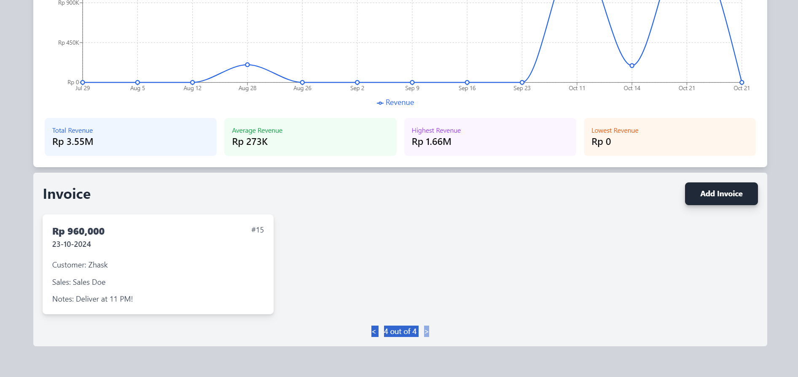
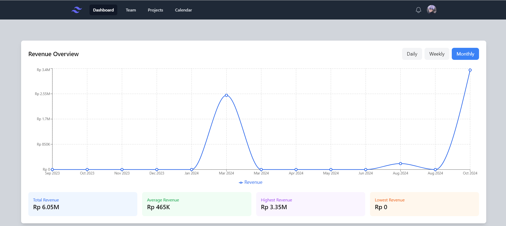
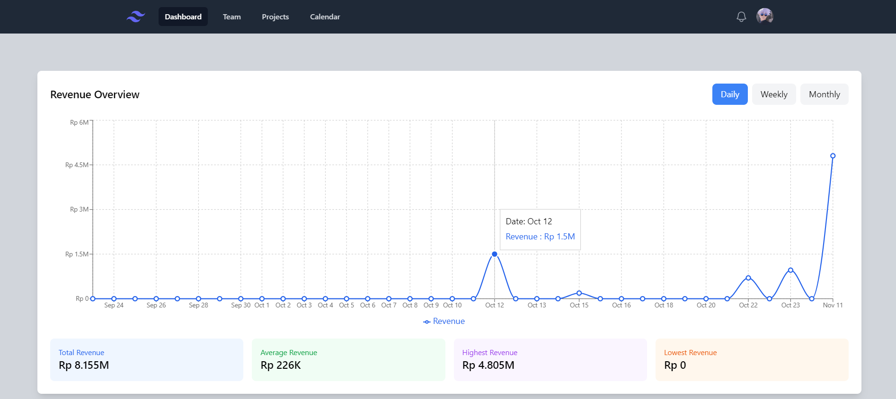

<h1>Section 1 - Add invoice with autocomplete for product input</h1>
<ul>
  <li>
    Mandatory invoice data are date, customer name, salesperson name, notes (optional), and multiple products sold.
     
     
    
     
     
     
  </li>
  <li>
    Autocomplete product suggestions as the user types. Each product suggestion should include product name, product picture, stock, and the price of the product.   User can also input and remove multiple products, seeing the total amount updates in real time.
     
     
    
     
     
    
     
     
     
  </li>
  <li>
    Form cannot be submitted when at least one of the input boxes are empty, show a warning message for invalid inputs (label or tooltip)
     
     
    
     
     
     
  </li>
  <li>
    Upon successful submission, proper notification pop-up should be shown, and will be redirected to the main page
     
     
    
  </li>
</ul>
 
 
 

<h1>Section 2 - Invoice card</h1>
<ul>
  <li>
    An invoice card with pagination to show invoices that have been published. The invoice cards should show summary of the invoice above such as customer name, salesperson name, total amount paid, and notes.
     
     
    
     
     
    
  </li>
</ul>
 
 
 

<h1>Section 3 - Time-series graph</h1>
<ul>
  <li>
    Show a graph to project revenue from invoices for daily, weekly, and monthly.
     
     
    
     
     
     
  </li>
  <li>
    It should enable user to pan and zoom to specific period. Auto scroll when new data is pushed
     
     
    
  </li>
</ul>
